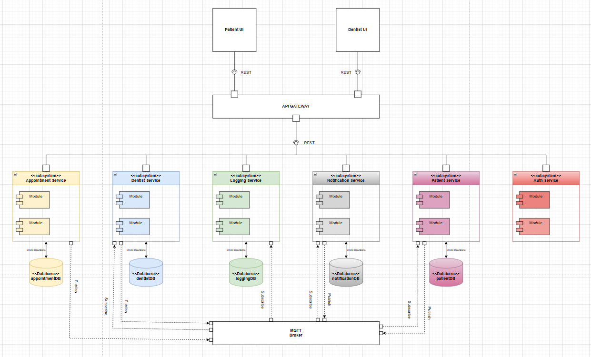
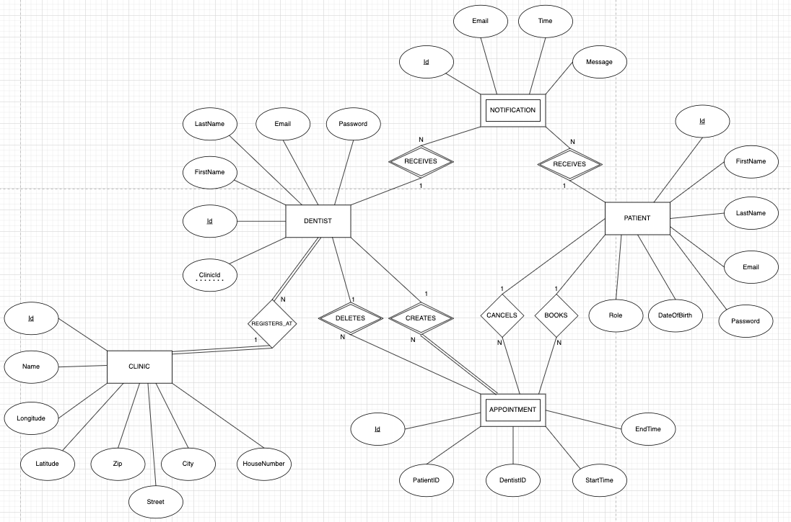
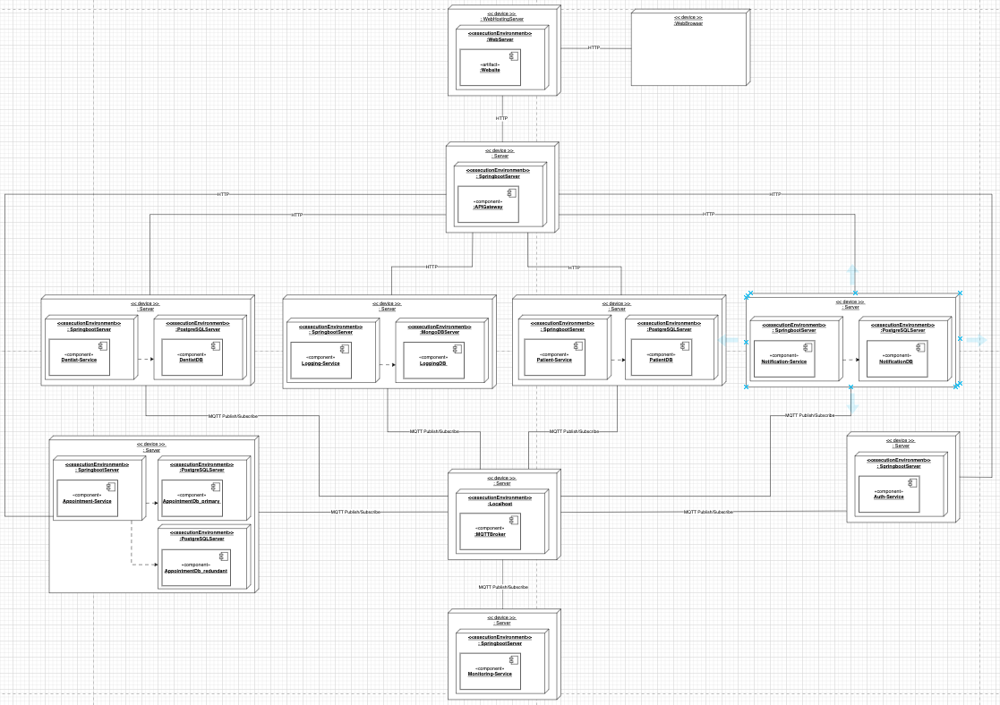

# SmileSelect

<h3>Table of Content </h3>

- [SmileSelect](https://git.chalmers.se/courses/dit355/2024/student_teams/dit356_2024_01/dit356-group1#dit356-group1)
  * [Synopsis & Motivation](#synopsis-motivation)
  * [Dependencies & Requirements](#dependencies-requirements)
  * [Installation & Usage](#installation-usage)
  * [Software Architechture](#software-architechture)
  * [Authors & Acknowledgment](#authors-acknowledgment)

## Synopsis & Motivation 

SmileSelect is a web-based application designed to streamline the process of finding and booking dentist appointments for residents in Gothenburg. Given the high demand for dental care and limited availability at many clinics, patients often face a time-consuming process involving searches and phone calls with low success rates. SmileSelect simplifies this experience by offering a responsive interface where users can view available appointment slots on a navigable map, select their preferred time windows, and book or cancel appointments with ease. 

The application employs a robust distributed system architecture using MQTT-based middleware to manage, update, and communicate appointment availability in real time, ensuring that users and clinics stay informed. This setup enhances fault tolerance, maintains data accuracy, and allows for seamless updates, ultimately making the dental booking experience more efficient and accessible while supporting better dental care access across the community.

SmileSelect: Smile-tacular dental care, just book and prepare!

## Dependencies & Requirements

 
## Installation & Usage

## Software Architechture 

Component Diagram

*This component diagram represents a microservice-based architecture for a distributed dental management system. The system is made up of multiple microservices, a central API Gateway, and an MQTT broker for asynchronous communication between services. Some details of the architecture are as follows:*

**User Interfaces:**

The system has two frontends: Patient UI and Dentist UI, which interact with the backend via the API Gateway using RESTful HTTP communication. 

**API Gateway:**

Acts as a single entry point for external communication, forwarding user requests to the respective microservices (i.e. Appointment-Service, Dentist-Service).

**Microservices:**

Each microservice is designed for a specific functionality:

* Appointment-Service: Manages appointments.
* Auth-Service: Handles authentication and authorization.
* Dentist-Service: Manages dentist-related data.
* Logging-Service: Handles logging operations for monitoring of events.
* Notification-Service: Sends notifications via MQTT.
* Patient-Service: Manages patient-related data.

**Databases**:

Each microservice (except Auth-Service) has a dedicated database to store its data, ensuring modularity and scalability.

**Communication**:

* Synchronous communication (REST) occurs between the API Gateway and microservices.
* Asynchronous communication (MQTT) is used for inter-service messaging, improving decoupling and scalability.

Entity-Relationship (ER) Diagram

*This ER diagram represents and outlines the structure of a dental management system, capturing the core relationships and data flows between clinics, dentists, patients, appointments, and notifications.*
*It models the relationships between these entities and their respective roles in the system.*

Deployment Diagram

## Authors & Acknowledgment

* **Erik Nisbet** (@eriknis)

* **Edvin Sanfridsson** (@edvsan)

* **Fredrik Nilsson** (@fnilsson)

* **Love Carlander Strandäng** (@loveca)

* **Martin Lidgren** (@marlidg)

    -------------------------------------------------------

    _SmileSelect - DIT356 H24 - University of Gothenburg, Sweden_
