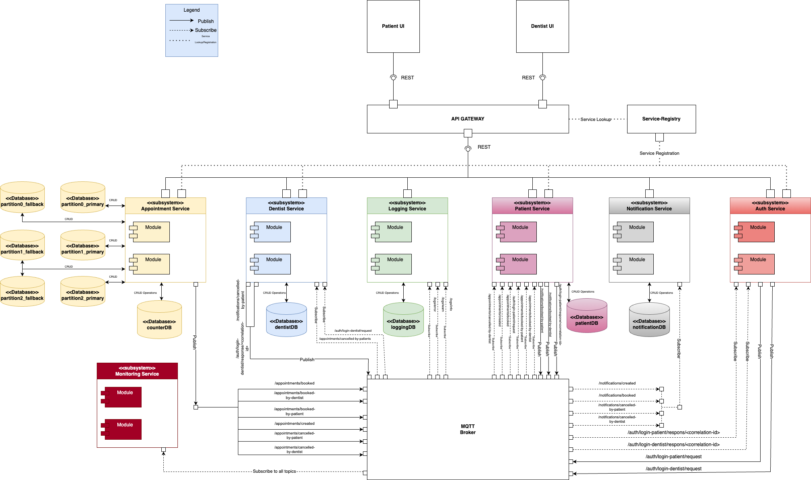

# SmileSelect

**SmileSelect** is a **full-stack web distributed system** to help book and manage dentist
appointments within Sweden. It is designed to allow for thousands of users to search and book appointments concurrently.
Partnered Dentists can also manage their work by publishing appointments or booking re-visits together with patients.
The system has a **microservices** architecture with focus on fault tolerance, scalability, maintainability and scalability.

## Table of Contents

1. [SmileSelect](#smileselect)
2. [Synopsis & Motivation](#synopsis-motivation)
3. [Technology](#technology)
   - [Backend](#backend)
   - [Frontend](#frontend)
   - [Testing](#testing)
4. [Dependencies & Requirements](#dependencies-requirements)
5. [Installation & Usage](#installation-usage)
6. [Software Architecture](#software-architecture)
   - [Component Diagram](#component-diagram)
   - [Entity-Relationship Diagram](#entity-relationship-diagram)
   - [Deployment Diagram](#deployment-diagram)
   - [Development View](#development-view)
7. [Authors & Acknowledgment](#authors-acknowledgment)

## Synopsis & Motivation 

SmileSelect is a web-based application designed to streamline the process of finding and booking dentist appointments for residents in Gothenburg. Given the high demand for dental care and limited availability at many clinics, patients often face a time-consuming process involving searches and phone calls with low success rates. SmileSelect simplifies this experience by offering a responsive interface where users can view available appointment slots on a navigable map, select their preferred time windows, and book or cancel appointments with ease. 

SmileSelect: Smile-tacular dental care, just book and prepare!

## Technology

#### Backend
- [Java v.21](https://www.oracle.com/se/java/technologies/downloads/#java21)
- [Apache Maven 4.0.0](https://maven.apache.org/download.cgi)
- [Spring Boot 3.3.5](https://spring.io/)
- [PostgreSQL 17](https://www.postgresql.org/)
- [Spring Cloud Netflix](https://cloud.spring.io/spring-cloud-netflix/reference/html/)
- [Mosquitto MQTT](https://mosquitto.org/)
- [Docker](https://docs.docker.com/get-started/get-docker/)
- [MongoDB](https://www.mongodb.com/)
#### Frontend
- [Vue 3](https://vuejs.org/)
- [Node 18](https://nodejs.org/en)
#### Testing
- [JUnit 5 Unit testing](https://junit.org/junit5/)
- [K6 Stress Test](https://k6.io/)
- [Spring Boot Test Integration Testing](https://spring.io/guides/gs/testing-web)

## Dependencies & Requirements

 
## Installation & Usage

This repository contains all the components of the system with their own installation and usage.
Following is a list of the system's components and their `README.md` files.
They should be read in the order listed.

- [**frontend**](smile-select-frontend/README.md): client-side web interface
- [**backend**]():  microservices spring boot backend
- [**service-registry**](): registry of service instances
- [**appointment-service**](): service handling appointments
- [**auth-service**](): service that authenticates users with [JWT Authentication](https://jwt.io/)
- [**dentist-service**](): service handling dentist operations
- [**gateway-service**](): service routing client requests to service instances
- [**logging-service**](): service logging errors and events
- [**monitoring-service**](): service monitoring current stress on the system
- [**notification-service**](): service handling email notifications to users
- [**patient-service**](): service handling patient operations
  
- [**stress-testing**](backend/stress-test/README.md): stress-testing of the system to identify architectural bottlenecks

## Software Architechture

Open the separate tabs to see diagrams and Architecture Descriptions

Component Diagram

*This component diagram represents a microservice-based architecture for a distributed dental management system. 
The system is made up of multiple microservices, a central API Gateway access point, a Service Registry for service discovery, and an MQTT broker for asynchronous communication between services. 
Some details of the architecture are as follows:*

**User Interfaces:**

The system has two frontends: Patient UI and Dentist UI, which interact 
with the backend via the API Gateway using RESTful HTTP communication. 

**API Gateway:**

Acts as a single entry point for client requests and communication, 
forwarding user requests to the respective microservices (i.e. Appointment-Service, 
Dentist-Service).

**Service Registry**

The Service Registry (Eureka Server) is integrated to manage and maintain a 
dynamic registry of all running microservices and adhering to location transparency. 
All microservices register themselves at the registry, 
enabling dynamic service discovery and removing the need for hardcoded endpoints.

**Microservices:**

Each microservice is designed for a specific functionality:

* Appointment-Service: Manages appointments.
* Auth-Service: Handles authentication and authorization.
* Dentist-Service: Manages dentist-related data.
* Logging-Service: Handles logging operations for monitoring of events.
* Monitoring-Service: Monitors all events in the system and provides real-time insight for health and performance.
* Notification-Service: Sends notifications via MQTT.
* Patient-Service: Manages patient-related data.

**Databases**:

Each microservice (except Auth-Service and Monitoring-Service) has dedicated databases to store its data, ensuring modularity and scalability.

**Communication**:

* Synchronous communication (REST) occurs between the API Gateway and microservices.
* Asynchronous communication (MQTT) is used for inter-service messaging, improving decoupling and scalability.

Entity-Relationship (ER) Diagram

*This ER diagram represents and outlines the structure of a dental management system, capturing the core relationships and data flows between clinics, dentists, patients, appointments, and notifications.*
*It models the relationships between these entities and their respective roles in the system.*

Deployment Diagram

This Deployment Diagram represents a distributed system architecture of SmileSelect, detailing the physical deployment of various components and their interactions:

**API Gateway:** 

Serves as the central entry point for managing all incoming HTTP requests from the WebClient, routing them to appropriate backend services.

**WebClient:** 

Represents the user-facing frontend, hosted on a web server and communicating with the backend via the API Gateway.

**Backend Services:** Includes modular services, each deployed on Spring Boot servers:

* Dental Service, Logging Service, Patient Service, and Notification Service for domain-specific operations.
* Appointment Service deployed with primary and redundant database configurations for fault tolerance.

**Databases:** 

Each service has its own dedicated PostgreSQL database (I.e. DentalDB, PatientDB, NotificationDB) for managing application data and data storage.

**MQTT Broker:** 

Enables real-time communication using a publish/subscribe mechanism for asynchronous event handling.

**Authentication Service:** 

A dedicated service managing user authentication and security.

**Communication:** 

* Most interactions between nodes occur over HTTP
* Publish/Subscribe messaging is used inter-service for asynchronous communication. 

Development View

*This Development View Diagram outlines a high-level structure of any given microservice. It shows the general layered architecture of the system's microservices with a controller-service-repository pattern.*

## Authors & Acknowledgment

* **Erik Nisbet** (@eriknis)

* **Edvin Sanfridsson** (@edvsan)

* **Fredrik Nilsson** (@fnilsson)

* **Love Carlander Strandäng** (@loveca)

* **Martin Lidgren** (@marlidg)

    -------------------------------------------------------

    _SmileSelect - DIT356 H24 - University of Gothenburg, Sweden_
