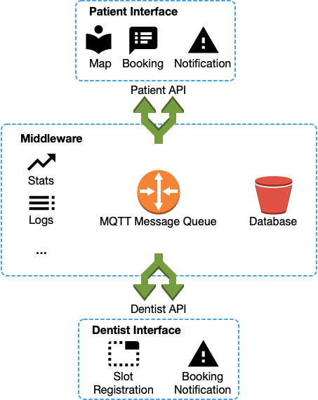

# Introduction
​
Our teeth are one of our most precious tools. We often don’t appreciate them enough until we lose them, for instance due to bad dental care. Doing annual checks with a dentist is therefore recommended. For someone moving to Sweden, or within Sweden, it is not always easy to get a dentist appointment as many practices are working on full capacity already and will reject you as a new care-taker. As a consequence, as of today, you are required to do a manual search online, and additional time-taking calls with little chance of success.
​
# Task Overview
​

You will create a service that allows residents of Gothenburg to book dentist appointments. Through a Web-based graphical user interface, a user shall be able to find available times in user- specified time-windows. Your solution will be based on a distributed system that combines various architectural styles. You will keep track of the availability of free time-slots for a number of fictitious dentists which you graphically signal to the user on a map. A user is able to book appointments and receives a confirmation/rejection through the system. A high-level conceptual overview of the system is shown below.
​

The system has (at least) the following core components:
​
- A responsive Web-based graphical user interface (GUI) for prospective patients to find and book appointments. You are free to use any framework you like for the GUI, but we recommend using Vue.js in line with DIT342.
- A scalable middleware layer that stores and manages appointment slots. The middleware layer needs to make use of messaging as an architectural paradigm, and needs to persistently store slots and appointments in a database. The middleware layer also needs to offer an API for dentists to register open slots and be notified when slots have been booked, or bookings have been cancelled.
- A tool (does not need to be Web-based) for dentists to register their available time slots and receive bookings / cancellations. The tool needs to be able to communicate with the middleware layer through the API. This tool is mainly used for demonstration and testing because it is intended that real dental clinics would integrate the middleware API into their own IT systems.
​
# Requirements
​
## General
​- The system needs to follow the high-level outline discussed above, and offer at least the discussed functionality in a user-friendly, usable manner.
- A middleware based on the MQ Telemetry Transport (MQTT) protocol must be used.
- Components communicating via middleware have no knowledge about the physical location of other components, and don’t depend on other components residing at a specific physical location (Distribution Transparency).
- The system must be reasonably fault tolerant. Specifically:
    - All components must be capable of appropriately handling standard failures, such as wrongly formatted data inputs or out of bounds inputs for the defined interfaces.
    - Resource-handling shall be mindful, e.g., stopped components must unsubscribe from the MQTT broker fulfilling the contract.
- For all components, a reasonable testing strategy needs to be in place. For example. unit and integration tests should be used where appropriate.
- The system needs to be maintainable and extensible, as project requirements tend to grow and change. Specifically, be prepared that **in early December you will be asked to incorporate some additional requirements and/or changes to the existing requirements.**
​
## Web Interface
The Web-based user interface shall
- contain a map-view over Gothenburg that can be navigated.
- visualize the supply/available slots for appointments (individual or grouped
availability using e.g., color coding or symbols, possibly changing at different
zoom levels...).
- allow for slot selection and booking.
- allow for booking cancellation.
- notify the user when new suitable slots become available, or when a slot they have booked is cancelled by the dentist.
- react to responses with appropriate messaging to the user.
- react to simultaneous bookings by making changes in availability visible to the user (without requiring an active refreshing of the interface by the user).
- be equally usable on a range of devices, including mobile devices and tablets.
​
## Architecture
- The task shall be solved through a Distributed Systems architecture. 
- The Distributed System should execute using a collection of nodes, so that each process is mapped onto a node. Nodes can be either separate hardware nodes, or separate operating system processes. 
- During the final demo, the system must be demonstrated to run on clearly independent processes, either by deploying the system on different cloud VMs or (at least) by starting the programs from different terminal windows on the same machine.
- The distributed system must consist of at least 4 distributed components, each clearly contributing to the purpose of the application and leading to an overall meaningful architecture. 
- Architectural styles such as Pipe-and-Filter, Publish/subscribe and Client/server are supposed to be combined.
- The architecture shall be well-documented to improve understanding and ease maintenance.
- Critical components shall be redundant to minimise the impact of failures and to continue operate. Specifically, doctors should be able to retreive their bookings and available time slots for the next 96 hours even in the event of a database failure. 
- The amount of data exchanged between the nodes shall be minimal to ensure high throughput.

​
## Development Process
The task shall be solved as a team of software engineers, using a well-defined development process, and with clearly assigned tasks and roles for individual group members. Particularly:

- The project shall be developed in four iterations (MS1 -- MS3 and the final delivery).
- You work in teams of 3-5 students (the number might change and will be announced in the first lecture).
- Each team of software engineers shall draft a social contract, specifiying the following:
    - Guidelines and expectations for collaboration within their team,
    - Communication protocols, decision-making processes, and conflict resolution strategies,
    - Code review procedures.
- At the start of each iteration, tasks for this iteration shall be planned, captured as issues on GitLab, and assigned to group members. Tasks can be assigned to multiple students, and tasks can be re-assigned, split, merged, or re-prioritized, but these changes to the planning shall be documented.
- At the end of each iteration (before milestone submission), the group shall conduct a retrospective and document what went well (and what did not).
- All code changes shall be submitted as pull requests on GitLab, and only be merged into the project main branch after code review by another group member.
- Git commit messages should clearly link each commit to an issue (task). Use the issue ID assigned by GitLab. Further, the commit message should clarify the state of this issue (e.g., is it completed now? tested?), and simultaneously to submitting or accepting the pull request the issue description and state in GitLab shall be updated.
- Code contributions shall, to the extent possible, be accompanied by automated test cases (particularly for backend functionality - no automated test cases are required for the Web frontend, although written test scenarios to conduct manually may still make sense).
- The provided documentation needs to be in sync with the code artifacts. For example, the final architecture described in the report needs to reflect the technical architecture of the implemented solution.

Groups are free to, but not required to, assign specific roles to individual students (e.g., "coordinator", "responsible for submitting required reports", "responsible for the web interface", "Scrum master", etc.). If the group decides to assign specific roles, please document them so that we can take them into account when assessing individual student contributions.

## Technology
You are largely free to choose the technology you want to use for the implementation. However, the middleware needs to indeed use MQTT.
​

Our suggestion is to use the following technologies. You are free to use other technologies, but we can only provide limited support if you run into problems with other technologies:
​
- Vue.js or Flask for the Web-based GUI
- MongoDB or Postgres as database
- Java or Python as programming language for the middleware
- Eclipse Mosquitto or RabbitMQ as message broker
- Eclipse Paho or HBMQTT as MQTT client library

If you follow the recommended technologies or if you choose to deviate from the suggestions, in any case you must motivate and defend the choices (both technology choices and design choices) you take throughout your project.
​
# Assessment
The project will be assessed along three dimensions during each milestone meeting and during the final examination of your project: 
(1) technical artifact (code, tests, demo, documentation), 
(2) architecture (design, efficiency in terms of throughput and latency, scalability, failure tolerance, architectural documentation), 
(3) development process (task planning, issues, traceability, following a pull request based workflow, clear tasks for each group member, etc.). Additionally, we will assess the contribution of each individual team member.
​
## Requirements MS1
At MS1, you should have:

* Broken down the above high-level requirements into concrete **user stories and tasks**. It is expected that these will still change, but the team needs to have thought through the entire project at this point.
* Developed an initial **architecture** for your system.
* Developed and documented a useful development process for your group and project.
* Finished initial technical tasks, amounting to **roughly 20%** of the technical solution (not necessarily in absolute numbers, but in amount of work required). As in every milestone, we will ask you to demo your technical work, so focus on completing tasks to the extent that they can be demoed.
* A **working** prototype. This can be a simple terminal application that demonstrate that some functionality of the system is working.

## Requirements MS2
At MS2, you should have:

* Refined your **user stories and tasks**.
* Continued working on the **architecture** for your system.
* Refined your development process based on your first retrospective.
* Finished **roughly 50%** of technical tasks (not necessarily in absolute numbers, but in amount of work required). 

## Requirements MS3
At MS3, you should have:

* Completed your system design, both in terms of **user stories and tasks** as well as in terms **architecture**.
* Incorporated **changes** in the system requirements.
* Potentially fine-tuned your development process based on your retrospective.
* Finished most of the technical tasks.

## Requirements Final Presentation
The time between MS3 and final submission should be seen as backup time to incorporate feedback from the last milestone review and clean up the project before final demonstration and grading. At the final submission (MS4), you should have:

* **Finished** the implementation of your project.
* Prepared a demonstration of your project.

## Deliverables and Submission
For each milestone, the following deliverables need to be prepared:

* Submit a **written report** containing documentation of your work in in the milestone. A focus should be put on your user stories, architecture, key tasks, (potentially) roles of team members, and the results of your retrospective. You should also briefly motivate your technology and design choices. The report needs to be submitted via **Canvas**.
* Make a **release on GitLab** of your technical work, and tag it as `MS-N` (where `N` is the number of the milestone, e.g., `MS-1`).
* Prepare a (max. 5 minutes) **demo** of your technical work for your milestone review.

For the final presentation, instructions will be provided separately later on in the course.
​
## Grading
The project will be graded throughout the teaching period during milestone meetings and you present the outcome in a final project examination at the end of the teaching period. See the Syllabus on Canvas for a detailed description of the grading process.

During each milestone meeting and during the final project examination, we will assess the following:

### Technical solution (25% of final grade)
**U** - solution either does not work, or does not fulfill the outlined requirements; *or* major components (e.g., the Web interface) are missing

**3** - the solution mostly works, but there are evident bugs in the solution; *or* smaller parts of the above requirements are not implemented; *or* the requirements are implemented, but the code quality and/or documentation of code overall is low

**4** - the system implements the outlined requirements, and code quality is reasonable

**5** - the system clearly exceeds the outlined requirements (e.g., the group has implemented significant additional requirements), and code quality is high

### Architecture (25% of final grade)
**U** - the technical architecture is not properly documented; *or* the documented technical architecture deviates significantly from the implemented system; *or* the technical architecture does not make sense

**3** - the technical architecture is documented and makes some sense, but there are aspects that could be improved

**4** - the technical architecture is documented, makes sense, and reflects the implemented system

**5** - the technical architecture is documented, and reflects the implemented system. The group demonstrated significant care to develop, adapt, and maintain a well-reasoned architecture, going **well beyond** a straight-forward implementation of what is provided in the course material.

### Development Process and Documentation (25% of final grade)
**U** - the group did not follow the outlined development process; *or* the development process is not documented

**3** - the group tried to follow the outlined development process, but there are frequent instances of process deviations (e.g., commits not linked to an issue, many changes in a single commit, important changes not captured in an issue, etc.). The choices of technology and design decisions are documented.

**4** - the group mostly followed the outlined development process, but there are some instances of process deviations; retrospectives have been conducted. The choices of technology and design decisions are documented and motivated. 

**5** - the group followed the outlined development process, and deviations are rare and well-documented / well-reasoned; retrospectives have been conducted, and have led to clear improvements in future iterations (if necessary). The choices of technology and design decisions are well documented and motivated in clear context of the project. 

### Individual Contribution (25% of final grade)
*(note: this is assessed on an individual level, based on assigned tasks, git commits, participation in milestone review meetings, and potentially assigned role)*

**U** - the student did not contribute adequately to the technical solution or reporting; *or* the student did not follow the outlined development process

**3** - the student contributed to the technical solution and reporting, but noticably less so than other team members

**4** - the student adequately contributed to the technical solution and reporting

**5** - the student's contributions to the technical solution and reporting are outstanding

**The final grade for each student is a weighted average of the individual grading dimensions. However, for each grading dimension at least a grade of 3 is required.**